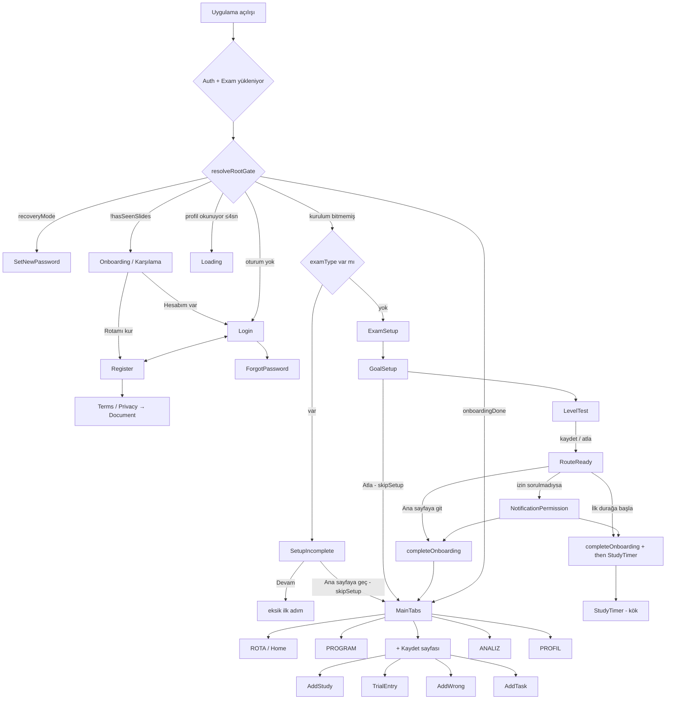
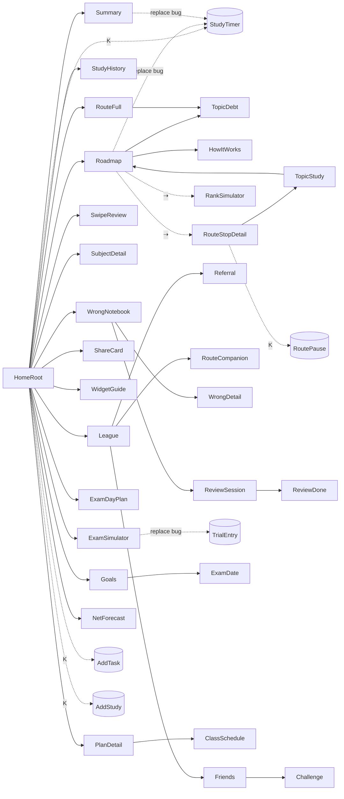
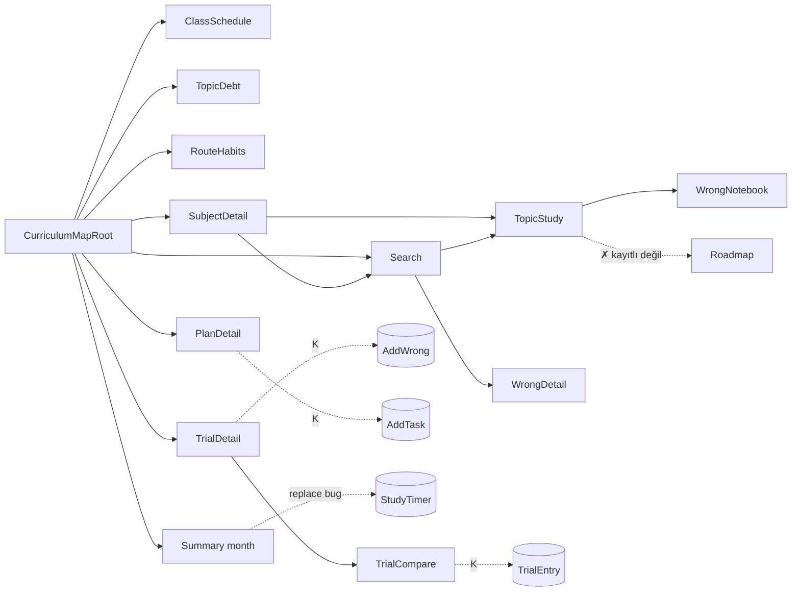
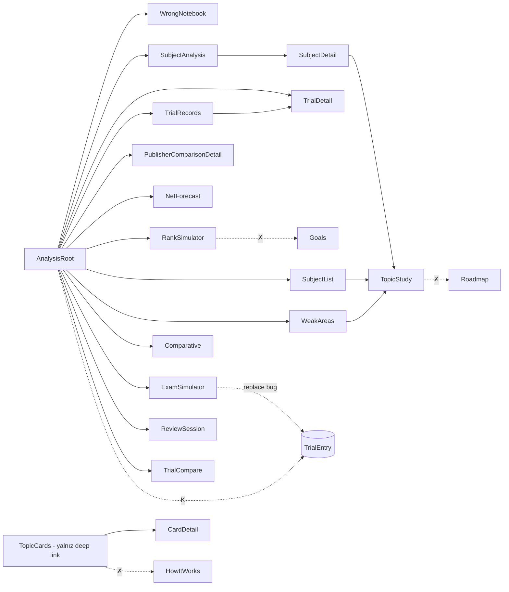
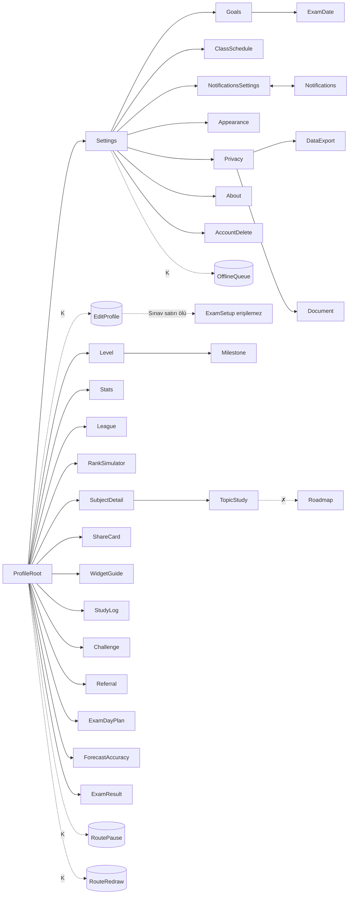

# 02 · Akış Haritası ve Hata Avı (yayın öncesi denetim)

Tarih: 2026-10-03 · Kapsam: `src/navigation/*`, `src/constants/screens.js`, tüm `src/screens/**`, ilgili hook/lib/context dosyaları.
Kaynak koda dokunulmadı (salt okuma). Yalnız bu rapor yazıldı.

---

## 0. Otomatik kontrollerin sonucu

`npm ci --ignore-scripts` sonrası:

| Komut | Sonuç |
|---|---|
| `npm run check:orphans` | Yetim ekran yok (110 ekran, 997 canlı dosya) |
| `npm run check:undefined` | Tanımsız değişken yok (1178 dosya) |
| `npm run check:runtime` | Çalışma zamanı riski yok (1176 dosya) |
| `npm run check:worklets` | Worklet dışı çağrı yok |
| `npm run check:conflicts` | Merge çakışması yok |
| `npm test` | **906 / 906 geçti**, 0 hata |

**Not:** Bu kontrollerin hiçbiri aşağıdaki hataları yakalamıyor. Yetim denetimi bir ekranı "kayıtlı + deep link'i var" diye canlı sayıyor, ama ekranın **hangi yığından** çağrıldığına bakmıyor. React Navigation 7'de `navigate(name)` yalnız mevcut yığında ve üst navigatörlerde arar, kardeş sekme yığınlarına inmez (`navigationInChildEnabled` kapalı). Prod'da sonuç sessiz bir no-op, dev'de "NAVIGATE was not handled" uyarısı. Sekmeler arası kaymalar bu yüzden testlerden geçiyor.

Deep link çözümlemesi `@react-navigation/core.getStateFromPath` ile `LINKING_SCREENS` üzerinde node'da doğrulandı (bkz. §A.5).

---

# PART A — Akış haritası

## A.1 Navigator yapısı

```
NavigationContainer (linking = linkingConfig)
└─ resolveRootGate(recovery > slides > auth > profile_loading > setup > app)
   ├─ RecoveryStack: SetNewPassword
   ├─ SlidesStack: Onboarding (Karşılama)
   ├─ AuthStack (initial = authIntent==="register" ? Register : Login)
   │    Login · Register · ForgotPassword · SetNewPassword · Terms · Privacy · Document
   ├─ Loading (profil okunuyor, en çok 4 sn)
   ├─ SetupStack (initial = examType ? SetupIncomplete : ExamSetup)
   │    SetupIncomplete · ExamSetup · GoalSetup · LevelTest · RouteReady · NotificationPermission
   │    + MainTabs + ROOT_ONLY (setup ekranları hariç)
   └─ AppStackInner (useDeepLink, usePostSetupLanding)
        MainTabs ─┬─ Home (ROTA)          → stack: HomeRoot + ROTA_STACK (38 ekran)
                  ├─ CurriculumMap (PROGRAM) → stack: CurriculumMapRoot + PROGRAM_STACK (24)
                  ├─ Add (FAB, AddStub → QuickAddSheet)
                  ├─ Analysis (ANALIZ)    → stack: AnalysisRoot + ANALIZ_STACK (23)
                  └─ Profile (PROFIL)     → stack: ProfileRoot + PROFIL_STACK (40)
        + ROOT_ONLY (37 ekran: StudyTimer, StudySave, StudySummary, TrialEntry, TrialSummary,
          AddStudy, AddWrong, EditStudyLog, AddTask, RoutePause, RouteRedraw, OfflineQueue,
          EditProfile, ChangePassword, EditEmail, LegalDoc, 15 premium/ödeme ekranı → LegacyHomeRedirect,
          7 kurulum ekranı)
```

## A.2 Üst düzey akış (açılış → kapı → kurulum → sekmeler)



## A.3 Sekme ağaçları (navigate/push/replace hedefleri)

Kısaltmalar: **[K]** = kök yığın (sekme çubuğu gizli), **⇢** = `openInTab` / `openProgram` ile sekme atlama, **✗** = hedef çağrıldığı yığında kayıtlı değil, sessizce çalışmaz.

### ROTA (Home)

- **HomeRoot** (`HomeScreen`, `useHomeActions`, `HomeOverlays`, `HomeCompletionOverlays`, hero varyantları)
  - Üst bant: `Profile` (sekme) · Takvim ⇢ Program/ay · Sosyal → `League {tab:groups}`
  - Hero: `StudyTimer` [K] (açık durak yoksa `AddTask` [K]) · `Roadmap` · `RouteFull` · `StudyHistory` · `RouteRedraw` [K] · `AddStudy` [K]
  - HomeProBody: `WrongNotebook` · `SwipeReview` · `SubjectDetail` · `PlanDetail` · `WidgetGuide` / `ShareCard` (keşif ipucu)
  - Overlay'ler: `ShareCard` · `AddTask` [K] · `SubjectDetail` · `PlanDetail` · `StudyTimer` [K] · nudge → `Goals` / `NetForecast` / `Roadmap` / ⇢ Analiz `Comparative`
  - Tamamlanma: `ExamDayPlan` · `Profile` · `Summary {week|day}` · `ShareCard` · ⇢ Program
  - Final hafta: `ExamSimulator` · `ExamDayPlan`; Donmuş rota: `DataExport`
  - Sınav sonrası satır: `ExamResult` / `ForecastAccuracy`
  - **Roadmap** → `TopicDebt` · ⇢ Program/hafta · `HowItWorks` · `AddTask` [K] · ⇢ `NetForecast` · ⇢ `RankSimulator` · ⇢ `RouteStopDetail` · `Goals` (RouteFeasibilityNote) · **`replace(StudyTimer)` → kökte MainTabs'i siler (Bug P1-3)**
    - **RouteFull** → `TopicDebt` · `RouteRedraw` [K]
    - **RouteStopDetail** → `StudyTimer` [K] · `RoutePause` [K] · `TopicStudy`
  - **League** → `Friends` → `Challenge` · `Referral` · `RouteCompanion`
  - **Summary** → `ShareCard` · `HowItWorks` · ⇢ Home · ⇢ Program/ay · **`replace(StudyTimer)` (Bug P1-3)**
  - **ExamSimulator** → **`replace(TrialEntry)` (Bug P1-3)**
  - **RankSimulator** → `Goals` / `TrialEntry` [K]
  - **TopicStudy** → `AddTask` [K] · `WrongNotebook` · `Roadmap`
  - **WrongNotebook** → `WrongDetail` · `AddWrong` [K] · `ReviewSession` → `replace(ReviewDone)` → `WrongNotebook` / ⇢ Home
  - **StudyHistory/StudyLog** → `EditStudyLog` [K] · `StudyTimer` [K] · `AddStudy` [K]
  - **PlanDetail** → `AddTask` [K] · `ClassSchedule` · `StudyTimer` [K]
  - **ForecastAccuracy** ↔ `replace(ExamResult)` · `ShareCard`
  - **Goals** → `ExamDate`



### PROGRAM (CurriculumMap)

- **CurriculumMapRoot** (`ProgramScreen`, görünümler: hafta / ay / müfredat)
  - Başlık: `Search`
  - Hafta: `ClassSchedule` · `TopicDebt` · `RouteHabits` · `PlanDetail` (SelectedDayPanel, yalnız bugün) · `AddTask` [K] (DayPlannedStops)
  - Ay: `TrialDetail {id, trial}` · `Summary {month}`
  - Müfredat: `SubjectDetail` → `TopicStudy` → (`AddTask` [K], `WrongNotebook`, **`Roadmap` ✗**) · `Search` (openHere) · `AddTask` [K]
  - **Search** → `TopicStudy` · `WrongDetail` · ⇢ Program/müfredat
  - **TrialDetail** → `AddWrong` [K] · `Analysis` (sekme) · `TrialCompare` → `TrialEntry` [K]
  - **TopicDebt** → ⇢ Program
  - **ClassSchedule** → geri / ⇢ Program



### ANALIZ (Analysis)

- **AnalysisRoot** (`AnalysisScreen` + `useAnalysisController.go`)
  - `WrongNotebook` · `SubjectAnalysis` · `TrialDetail` · `TrialRecords` · `PublisherComparisonDetail` · `NetForecast` · `RankSimulator` · `SubjectList` · `WeakAreas` · `Comparative` · `ExamSimulator` (gated) · `ReviewSession {quick_practice}` · `TrialCompare` (gated) · `TrialEntry` [K] (yapışkan buton) · nudge → `SubjectDetail`
  - **SubjectAnalysis** → `SubjectDetail` · `WrongNotebook` · `TrialCompare`
  - **SubjectList** → `TopicStudy` · `AddTask` [K] · `Analysis`
  - **WeakAreas** → `TopicStudy` · `SubjectList` · ⇢ Program/müfredat
  - **TrialRecords** → `TrialDetail`
  - **RankSimulator** → **`Goals` ✗** (targetNet yoksa) · `TrialEntry` [K]
  - **ExamSimulator** → **`replace(TrialEntry)` (Bug P1-3)**
  - **TopicStudy** → **`Roadmap` ✗**
  - **TopicCards** (yalnız `maraton://kartlar`) → `CardDetail` · `QuickPractice` · **`HowItWorks` ✗**



### PROFIL (Profile)

- **ProfileRoot** (`ProfileScreen` + bileşenler)
  - Üst bar: `Settings` · Hero: `EditProfile` [K] · `Level` → `Milestone` → `ShareCard` / `Home`
  - Kartlar: `Stats` · `League {global|groups}` · `RankSimulator` · `SubjectDetail` (StrengthMap) → `TopicStudy` (→ **`Roadmap` ✗**)
  - Kutucuklar: `ShareCard` · `WidgetGuide`
  - Satırlar: `StudyLog` · `League` · `Challenge` · `Referral` · (`Premium`, yalnız PREMIUM_ENABLED) · `ExamDayPlan` / `ForecastAccuracy` / `ExamResult` · `RoutePause` [K] · `RouteRedraw` [K]
  - **Settings** → `EditProfile` [K] · `Goals` · `ExamDate` · `ClassSchedule` · `RouteHabits` · `StudyLog` · ⇢ Program/ay · `NotificationsSettings` ↔ `Notifications` · `Appearance` · `Privacy` → `DataExport` / `Document` · `Terms` · `About` · `Friends` · `RouteCompanion` · `Challenge` · `Referral` · `EditEmail` [K] · `ChangePassword` [K] · `AccountDelete` · `OfflineQueue` [K]
  - **EditProfile** [K] → `EditEmail` · `ChangePassword` · ⇢ Profil `ExamDate` / `Goals` · **"Sınav" satırı onPress yok** (sınav tipi değiştirilemez, Bug P1-8)
  - **Notifications** (bildirim satırı) → `openHere(canonicalTab)` ya da kök



## A.4 Bulgular: yetim ekranlar, kayıtsız hedefler, iki yığın farkı

**Kayıtlı ama UI'dan erişilemeyen ekranlar**

| Ekran | Durum |
|---|---|
| `TopicCards`, `CardDetail` | Hiçbir `navigate` yok; yalnız `maraton://kartlar` deep link'i. Kod içinde `HowItWorks` çağrısı ANALIZ'de ✗. |
| AppStack kökündeki `Onboarding`, `SetupIncomplete`, `ExamSetup`, `GoalSetup`, `LevelTest`, `RouteReady`, `NotificationPermission` | Kurulum bittikten (ya da atlandıktan) sonra **hiçbir giriş noktası yok**. `postSetupLanding.js:29` yorumu "kurulumu atlamış kullanıcı Profil'den tamamlıyor" diyor ama böyle bir satır yok. Bkz. Bug P1-8. |
| 15 premium/ödeme ekranı | `LegacyHomeRedirectScreen`'e bağlı (bilinçli, V1). `ProfileScreen` "Premium" satırı `PREMIUM_ENABLED` ile gizli. Sızıntı yok. |
| `WeeklyTrialReview`, `SwipeReview`, `QuickPractice`, `StudyLog`, `WeeklyReview` | Takma ad rotalar (eski link uyumu); bilinçli. |

**Çağrıldığı yığında kayıtlı olmayan `navigate()` hedefleri (sessiz no-op)**

| Çağrı | Çağıranın yığınları | Hedefin yığınları | Kırık olduğu yer |
|---|---|---|---|
| `TopicStudyScreen.js:80` → `Roadmap` | ROTA, PROGRAM, ANALIZ, PROFIL | yalnız ROTA | PROGRAM, ANALIZ, PROFIL |
| `RankSimulatorScreen.js:72` → `Goals` | dört sekme | ROTA, PROGRAM, PROFIL | ANALIZ |
| `TopicCardsScreen.js:74` → `HowItWorks` | ANALIZ | ROTA, PROGRAM, PROFIL | ANALIZ |
| `PrivacyScreen.js:29` → `DataExport` | PROFIL **+ AuthStack** | ROTA, PROGRAM, PROFIL | AuthStack (Kayıt → Gizlilik → "Verilerimi indir") |

`screens.js` dışında bir ad kullanan çağrı yok. Tek string `"MainTabs"` (`ROOT_STACK.MAIN_TABS`).

**Sekme yığınından kök ekrana `replace()`.** Kök yığının `state.index`'teki rotası `MainTabs` olduğu için bu çağrı bütün sekme ağacını siler (`StackRouter` REPLACE, `@react-navigation/routers@7.6.4`, satır 323-327; `action.target` tanımsızken `state.index` kullanılıyor):
- `useRoadmapNextAction.js:21` (Roadmap ve Summary'den) → `StudyTimer`
- `ExamSimulatorScreen.js:55` → `TrialEntry`

**Aynı ekran, iki yığında farklı davranış**
- `TopicStudy`: "Rotadaki yeri" yalnız ROTA'da açılıyor.
- `RankSimulator`: boş halde "Hedef belirle" ANALIZ'de ölü, diğerlerinde çalışıyor.
- `ExamSimulator`: hem ROTA hem ANALIZ'de bitişte sekme ağacını siliyor.
- `Summary`: ROTA'dan da PROGRAM'dan da "sonraki durağa başla" sekme ağacını siliyor. Kök `StudySummary`'den aynı hook doğru çalışıyor (kökten köke replace).
- `ReviewSession {quick_practice}` (Analiz "Hızlı pratik"): tekrarı gelen soru yoksa kullanıcı açıklamasız biçimde `WrongNotebook`'a `replace` ediliyor.

## A.5 Deep link denetimi

`getStateFromPath` ile doğrulandı. Örnekler:

| URL | Çözülen durum | Değerlendirme |
|---|---|---|
| `rota`, `plan`, `ozet/week`, `yanlis/tekrar`, `sinav/plan`, `friend/X`, `group/X` | `MainTabs > Home > [HomeRoot, …]` | Doğru, geri tuşu Ana Sayfa'ya döner |
| `deneme/123`, `deneme/kayitlar`, `deneme/karsilastir`, `yanlis/42`, `yanlis/yeni` | Doğru ekrana çözülüyor, `:id` çakışması yok | OK |
| `analiz`, `home` (widget'lar) | Sekme | OK |
| **`deneme/yeni`** (yerel bildirim `trial_reminder`, `notificationPlan.js:92`) | **`[TrialEntry]` tek rota, altında MainTabs yok** | **Soğuk açılışta geri dönülemiyor (Bug P1-4)** |
| `calis/:k`, `calisma/kaydet`, `premium`, `pro` | Kökte tek rota | `StudyTimer` `canGoBack` yedeğine sahip. `AddStudy` / `AddWrong` geri tuşunda takılıyor (ama bunları üreten widget ya da bildirim yok). premium/pro LegacyRedirect ile Ana Sayfa'ya iniyor. |
| `gizlilik`, `kosullar` (oturum yokken) | `MainTabs > Profile > Privacy` | AuthStack'te `Privacy` kökte kayıtlı, `MainTabs` altında değil. Link hiçbir yere gitmiyor (P2). |
| Kurulum (SETUP) kapısındayken herhangi bir sekme linki | `MainTabs > …` | `SetupStack` `MainTabs`'i de kaydediyor. Soğuk açılışta link kurulumu tamamen atlatabilir (muhtemel, P2). |
| send-push (`maraton://plan`, `maraton://ozet/week`) | Doğru | OK |

---

# PART B — Hata avı (önem sırasına göre)

Önem: **P0** çökme ya da veri kaybı/bozulması · **P1** kırık akış · **P2** görsel/küçük. Güven: **kesin** (kod yolu uçtan uca okundu) / **muhtemel** (tetiklenmesi koşula ya da canlı ortama bağlı).

## P0

### P0-1 · Pomodoro faz zinciri: 25 dakika dolunca her saniye +25 dk sahte odak yazılıyor (kesin)
- **Dosya:** `src/screens/study/useStudyTimerController.js:190-235` (`advancePhase` + tick efekti)
- **Ne oluyor:** Süre duvar saatinden hesaplanıyor: `next = elapsedFrom(accumulatedRef, startedAtRef)`. `advancePhase` yalnız `setElapsed(0)` yapıyor; `accumulatedRef` ve `startedAtRef` sıfırlanmıyor. Faz değişince efekt yeniden kuruluyor. Bir sonraki tick'te `next` yine oturumun başından beri geçen toplam süre (≥ 1500 sn), bu da yeni fazın hedefini (mola 300 sn) aşıyor. Sonuç: `advancePhase` her saniye tekrar çalışıyor (ODAK→MOLA→ODAK…) ve her ODAK bitişinde `totalFocusSeconds += 1500` ekleniyor. Her saniye `H.success()` titreşimi de çalıyor.
- **Tekrar:** Varsayılan mod POMODORO_25 → Başlat → 25 dk bekle (ya da arka plana at) → birkaç saniye sonra Bitir. Kayıt ekranında süre saatlerce, `StudySave`'de `duration` şişmiş. XP, seri, haftalık lig ve "Plan vs Gerçek" bozuluyor. Kronometre ekranda dururken de pil ve titreşim boşa harcanıyor.
- **Düzeltme:**
```js
// advancePhase icinde, setElapsed(0) yanina:
accumulatedRef.current = 0;
startedAtRef.current = running ? Date.now() : null;
```
  Ayrıca faz hedefini `elapsedFrom` yerine "faz başlangıcından beri geçen süre" ile ölçen bir `phaseStartedAtRef` daha sağlam olur. Arka planda birden çok faz atlandıysa bu farkı döngüyle dağıtın.

### P0-2 · Mod değiştir / özel mod uygula "sıfırlanacak" diyor ama süre sıfırlanmıyor (kesin)
- **Dosya:** `useStudyTimerController.js:179-188` (`resetTimer`), `:138-148` (`applyCustomMode.doApply`)
- **Ne oluyor:** Her iki fonksiyon da `elapsed`, `totalFocusSeconds` ve `running` değerlerini sıfırlıyor, ama `accumulatedRef` / `startedAtRef` aynı kalıyor. Kronometre çalışırken değiştirilirse `startedAtRef` dolu kalıyor. Uygulama öne gelince `AppState` dinleyicisi (`:268-275`) eski süreyi ekrana geri yazıyor. Bir sonraki Başlat'ta `toggle` yalnız `startedAtRef`'i yeniliyor, `accumulatedRef` eski değerde. Böylece "sıfırlanan" süre kayda geri ekleniyor.
- **Tekrar:** Serbest modda 20 dk → mod değiştir → "Değiştir" → Başlat → 1 dk → Bitir: ~21 dk kaydediliyor.
- **Düzeltme:** `resetTimer` ve `doApply` içinde `accumulatedRef.current = 0; startedAtRef.current = null;` ve `clearTimerSession()`.

### P0-3 · Çevrimdışı aynı içerikli ikinci kayıt sessizce düşüyor (kesin)
- **Dosya:** `src/lib/offlineQueue.js:139-147` (`enqueueLocked` parmak izi tekilleştirmesi), `src/domain/study/studyLogModel.js:63-74`, `trialFingerprint`
- **Ne oluyor:** Çalışma kaydının parmak izi `user|tarih|ders|konu|soru|doğru|dakika`. Ağ yokken aynı gün aynı konuda iki eş Pomodoro (ör. 25 dk, 0 soru) girilirse ikincisi kuyrukta "zaten var" sayılıyor. Fonksiyon yine de **yeni** `clientOperationId` döndürüyor, kullanıcıya "kuyrukta" deniyor, ama kayıt hiç saklanmıyor. Redux'a `addLog` ile yazıldığı için yalnız o oturumda görünüyor; sonraki senkronda kayboluyor.
- **Tekrar:** Uçak modu → iki kez 25 dk Matematik/Türev, 0 soru kaydet → ağı aç → sunucuda tek kayıt.
- **Düzeltme:** Kullanıcı kaynaklı (`STUDY_LOG`, `TRIAL`, `WRONG_QUESTION`) işlemlerde tekilleştirmeyi yalnız `clientOperationId` ile yapın. Parmak izini sadece tekrar deneme (aynı `clientOperationId`) için kullanın. Tekilleştirme olursa mevcut kaydın id'sini döndürün.

## P1

### P1-1 · PREMIUM kapalıyken çevrimdışı/erişim hatasında deneme girişi tamamen kilitleniyor (kesin)
- **Dosya:** `src/screens/trial/useTrialQuotaGate.js:16-17,54-58`, `src/screens/trial/TrialEntryScreen.js:68-75`, `src/screens/trial/trialEntrySubmit.js:47-55`, `src/contexts/PremiumContext.js:39-60`
- **Ne oluyor:** `PremiumProvider`, `PREMIUM_ENABLED=false` olsa bile her açılışta `getProductAccessSnapshot()` çağırıyor. Ağ yoksa ya da RPC hata verirse `accessState="error"` oluyor. Bu durumda `useTrialQuotaGate.error` true dönüyor ve TrialEntry formu hiç açılmıyor; yerine "Deneme hakkın doğrulanamadı … kotandan" ekranı geliyor. Erişim yüklenirken de form iskelette bekliyor. Form açılmış olsa bile `submitTrialEntry` `accessReady` false olduğunda "üyelik durumunu kontrol edemedik" diyerek kaydı reddediyor. Çevrimdışı kuyruğun (saveTrialOffline) bütün amacı boşa gidiyor ve ücretsiz sürümde kota/üyelik dili sızıyor.
- **Tekrar:** Uçak modu → uygulamayı aç → + → Deneme.
- **Düzeltme:**
```js
// useTrialQuotaGate
if (!PREMIUM_ENABLED) return { loading: false, error: false, blocked: false, sheet: null };
// trialEntrySubmit
if (PREMIUM_ENABLED && !accessReady) { ... }
// PremiumContext: PREMIUM_ENABLED false iken refreshAccess'i atla, accessState="ready"
```

### P1-2 · `useFeatureEntry`, PREMIUM kapalıyken ücretsiz özellikleri ağa bağlıyor (kesin)
- **Dosya:** `src/hooks/useFeatureEntry.js:20-40`
- **Ne oluyor:** `canAccessProductFeature` bayrak kapalıyken `true` döndürüyor. Ama ondan **önce** `accessLoading || accessError` dalı `refreshUsage()` çağırıyor; başarısız olursa "Bağlantı doğrulanamadı — Üyelik durumunu kontrol edemedik" uyarısıyla `false` dönüyor. Etkilenen girişler: Senaryolar (`useRouteDetail`, `useScenarioView`), Deneme karşılaştır (`useTrialCompareEntry`), Bölüm eşiği (`useThresholdView`), Deneme geçmişi (`useTrialRecords`), Aylık rapor (`SummaryScreen`). Açılışta erişim yüklenirken her dokunuş ek bir ağ isteği de tetikliyor.
- **Düzeltme:** `ensure` fonksiyonunun başına `if (!PREMIUM_ENABLED) return true;` ekleyin.

### P1-3 · Sekme yığınından köke `replace` bütün sekme ağacını siliyor, geri çıkış ölü (kesin)
- **Dosya:** `src/screens/roadmap/useRoadmapNextAction.js:20-21` (Roadmap ve Summary bunu kullanıyor), `src/screens/simulator/ExamSimulatorScreen.js:55`
- **Ne oluyor:** `StudyTimer` ve `TrialEntry` yalnız kök yığında. `replace` sekme yığınında karşılanamıyor ve köke kabarcıklanıyor. Kökte `action.target` tanımsız olduğu için `state.index` rotası, yani **MainTabs**, değiştiriliyor (routers 7.6.4, `StackRouter.tsx:323-360`). Sonuçlar:
  - Dört sekmenin bütün durumu kayboluyor; kök yığında tek ekran kalıyor.
  - `TrialEntry` "Vazgeç" (`exitScreen = navigation.goBack()`) → GO_BACK karşılanmıyor, kullanıcı formda sıkışıyor. Android'de donanım geri tuşu uygulamayı kapatıyor.
  - Timer'da "Çok kısa → Çık" (`:396`), `goBack` çağırıyor ve takılıyor. `StudySave` ekranındaki geri de takılıyor. Kurtuluş yalnız kaydı bitirmek.
- **Tekrar:** Ana Sayfa → Rota → "Sıradaki durağa başla" → 10 sn → Bitir → "Çok kısa / Çık". Ya da Analiz → Simülasyon → bitir → "Sonuçları gir" → Vazgeç.
- **Düzeltme:** Sekme yığınından köke geçişte `replace` yerine `navigate` kullanın:
```js
// useRoadmapNextAction
navigation.navigate(SCREENS.STUDY_TIMER, routeActionTimerParams(nextRouteAction));
// ExamSimulatorScreen
onEnterResults={() => { navigation.goBack(); navigation.navigate(SCREENS.TRIAL_ENTRY); }}
```
  Ek güvence: `TrialEntry.exitScreen`, `AddStudy.goBack`, `AddWrong`, `StudySave.goBack` ve timer "Çık" için `canGoBack() ? goBack() : openInTab(navigation, TAB_KEYS.ROTA, SCREENS.HOME)`.

### P1-4 · "Deneme hatırlatması" bildirimi soğuk açılışta TrialEntry'yi tek başına açıyor; vazgeçince çıkış yok (kesin)
- **Dosya:** `src/navigation/routes.js:203-205` (`ROOT_LEVEL`, initialRouteName yok), `src/lib/notifications.js:171`, `src/domain/notify/notificationPlan.js:92`
- **Ne oluyor:** `maraton://deneme/yeni` çözülünce `{routes:[{name:"TrialEntry"}]}` çıkıyor; MainTabs altta değil. Uygulama kapalıyken bildirime dokunan kullanıcı formdan vazgeçerse `goBack` karşılanmıyor. Bir de P1-1 nedeniyle çevrimdışıysa hata ekranında sıkışıyor.
- **Düzeltme:** Kök deep link'lerin altına sekme koyun:
```js
export const LINKING_SCREENS = {
  initialRouteName: ROOT_STACK.MAIN_TABS, // React Navigation 7: config.initialRouteName
  ...
};
```
  (ya da `linkingConfig.config = { initialRouteName: "MainTabs", screens: LINKING_SCREENS }`). Ayrıca P1-3'teki `canGoBack` yedeklerini ekleyin.

### P1-5 · TopicStudy "Rotadaki yeri" ROTA dışında ölü (kesin)
- **Dosya:** `src/screens/dersler/TopicStudyScreen.js:80`
- **Ne oluyor:** `TopicStudy` dört sekmede kayıtlı, `Roadmap` yalnız ROTA'da. Program → Müfredat → Ders → Konu → "Rotadaki yeri" dokunuşu hiçbir şey yapmıyor. Analiz ve Profil'den gelindiğinde de aynı.
- **Düzeltme:** `go: () => openHere(navigation, TAB_KEYS.ROTA, SCREENS.ROADMAP)`

### P1-6 · Bölüm Eşiği boş halinde "Hedef belirle" Analiz sekmesinde ölü (kesin; tetik: targetNet yok)
- **Dosya:** `src/screens/simulator/RankSimulatorScreen.js:72`, `tabAssignment.js` (`ANALIZ_STACK`'te `GOALS` yok)
- **Düzeltme:** `ANALIZ_STACK`'e `SCREENS.GOALS` ve `SCREENS.EXAM_DATE` ekleyin, ya da `openHere(navigation, TAB_KEYS.PROFIL, SCREENS.GOALS)` kullanın.

### P1-7 · Kronometreden "Geçmiş" açmak sekme atlatıp çalışan oturumu kesiyor (kesin, düşük etki)
- **Dosya:** `useStudyTimerController.js:449-451` (`openHistory`)
- **Ne oluyor:** Kökteki timer'dan `openInTab(PROFIL, STUDY_HISTORY)`, `navigate("MainTabs")` yapıyor. v7'de var olan rotaya `navigate`, üstündeki StudyTimer'ı pop ediyor. Kronometre uyarısız kapanıyor; anlık görüntü kaldığı için kurtarma sorusu çıkıyor ama akış kopuyor.
- **Düzeltme:** `running || elapsed > 0` iken onay iste, ya da geçmişi modal olarak aç.

### P1-8 · Kurulumu atlayan ya da yanlış sınav seçen kullanıcı kuruluma bir daha giremiyor (kesin)
- **Dosya:** `src/screens/onboarding/SetupIncompleteScreen.js:48-53`, `useGoalSetupForm.js:91-95` (`skipSetup`), `src/screens/settings/components/EditProfileAccountSection.js:47` ("Sınav" satırında `onPress` yok), `src/lib/postSetupLanding.js:29`
- **Ne oluyor:** `ExamSetup`, `GoalSetup`, `LevelTest`, `RouteReady`, `SetupIncomplete` AppStack kökünde kayıtlı, ama uygulama içinden hiçbir `navigate` bunlara gitmiyor (yalnız `useSetupProgress` → SetupIncomplete, o da yalnız SetupStack'te). Sonuçlar:
  - (a) "Ana sayfaya geç" diyen kullanıcı başlangıç neti ve rota oluşturmayı bir daha göremiyor.
  - (b) YKS yerine LGS seçen kullanıcı sınav tipini değiştiremiyor.
  - (c) `ExamSetup` sınav tarihini sabit `new Date(year, 5, 15)` olarak yazıyor; tarih yalnız ExamDate'ten düzeltilebiliyor.
- **Düzeltme:** EditProfile "Sınav" satırına `onPress={() => navigation.navigate(SCREENS.EXAM_SETUP)}` ekleyin (kökte kayıtlı). Ana Sayfa ya da Profil'e, `!setupCompleted` iken görünen bir "Kurulumu tamamla" satırı (→ `SETUP_INCOMPLETE`) ekleyin.

### P1-9 · Yeni cihazda profil okunamazsa dönen kullanıcı kurulumu baştan yapıp sunucu profilini eziyor (muhtemel)
- **Dosya:** `src/contexts/ExamContext.js:196-299`, `src/lib/profileSettleGate.js` (`PROFILE_SETTLE_MAX_MS = 4000`)
- **Ne oluyor:** `getProfile` hata verirse `catch(() => {})` sonrası `profileReadyFor = userId` oluyor ve gate açılıyor. examType yerelde olmadığı için kullanıcı SetupStack/ExamSetup'a düşüyor. Orada seçtiği değerler `syncExamConfig` ile sunucudaki gerçek `exam_type` / `exam_date` alanlarının üzerine yazılıyor. Yavaş ağda (>4 sn) da aynı ekran açılıyor; profil sonradan gelirse düzeliyor, hata verirse düzelmiyor.
- **Düzeltme:** Profil okuması **hata** ile biterse SETUP yerine "Profilin yüklenemedi — Tekrar dene" ekranı gösterin. `profileReadyFor`'u yalnız başarıda set edin, hatada `profileError` tutun.

### P1-10 · Seviye ekranında sabit sahte "bu hafta kazanılan" verisi (kesin)
- **Dosya:** `src/screens/profile/components/WeeklyGains.js:10-14` (Profil → Seviye, `LevelScreen.js:87`)
- **Ne oluyor:** Her kullanıcıya "412 soru çözüldü +206", "2 deneme girildi +120", "7 gün seri korundu +70" gösteriliyor. Yeni kullanıcıda bile görünüyor. Mağaza incelemesinde ve kullanıcı güveninde risk.
- **Düzeltme:** `weeklyXP` / `stats` üzerinden hesaplayın ya da bileşeni kaldırın.

## P2

| # | Dosya:satır | Sorun | Güven | Öneri |
|---|---|---|---|---|
| P2-1 | `ReviewDoneScreen.js:41` | "Yarın 4 soru, üç gün sonra 7 soru bekliyor." sabit metin (TODO'da da var). `{rememberedCount}'ünü` / `{forgotCount}'si` ekleri sayıya göre çekimlenmiyor ("5'ünü" olmalı "5'ini"). | kesin | `useDueReviews` ile gerçek sayıları kullanın; `lib/turkishSuffix.withCase` ile çekimleyin |
| P2-2 | `EditProfileAccountSection.js:43` | `` `${since}'ten beri` `` → "3 Ekim 2026'ten" (doğrusu 'dan) | kesin | `withCase(since, "ablative")` |
| P2-3 | `NotificationPermissionScreen.js:84-90, 126` | "ROTA YENİDEN ÇİZİLDİ / İlk denemen rotaya işlendi" metni seviye testini atlayan kullanıcıya da gösteriliyor; "bir hafta sonra tekrar sorarız" vaadini karşılayan kod yok | kesin | `onboardingSummary.hasBaselineNet` ile metni koşullu yapın |
| P2-4 | `TopicCardsScreen.js:74` | ANALIZ'de `HowItWorks` ✗; ekran zaten yalnız deep link ile açılıyor | kesin | `openHere(..., TAB_KEYS.PROFIL, SCREENS.HOW_IT_WORKS)` ya da ANALIZ_STACK'e ekleyin |
| P2-5 | `PrivacyScreen.js:29` (AuthStack) | Giriş öncesi Gizlilik → "Verilerimi indir" ölü | kesin | `user` yoksa satırı gizleyin |
| P2-6 | `routes.js` linking + AuthStack | `maraton://gizlilik` / `kosullar` oturum yokken hiçbir yere gitmiyor | kesin | AuthStack için ayrı linking dalı ya da `ROOT_LEVEL`'de Terms/Privacy |
| P2-7 | `AppNavigator.js:159-169` | SetupStack `MainTabs`'i kaydediyor; kurulum kapısında soğuk açılan bir sekme linki (ör. send-push `maraton://plan`) kurulumu atlatabilir | muhtemel | SetupStack'ten `MainTabs`'i çıkarın (SetupIncomplete reset'i zaten stack değişimiyle gereksiz) |
| P2-8 | `AuthContext.js:57` | 2 sn güvenlik zamanlayıcısı `getSession` bitmeden `loading=false` yapıyor; yavaş SecureStore'da Login bir an görünüp kayboluyor | muhtemel | Zamanlayıcıyı 5 sn yapın ya da kaldırın; `getSession` zaten `finally`'de kapatıyor |
| P2-9 | `useDataSync.js:89-95` | `loadAll` okumadan önce `flushQueue` bekliyor (60 sn'ye kadar). Yavaş ağda Ana Sayfa iskelette kalıyor; `enqueue` de aynı kilitte beklediği için kaydet butonu dönüp duruyor | muhtemel | Flush'ı okumalardan sonra ya da paralel çalıştırın; `enqueue`'yu flush kilidinden ayırın |
| P2-10 | `offlineQueue.js:20,330` | 7 günden eski kuyruk kaydı sessizce dead-letter'a gidiyor | kesin | Kullanıcıya OfflineQueue ekranında görünür uyarı verin |
| P2-11 | `useStudySaveController.js:173-181` | `addLog` kalıcı yazımdan **önce** dispatch ediliyor; yazım hata verip kullanıcı tekrar denerse Redux'ta çift kayıt oluşuyor | kesin | `dispatch(addLog)`'u `saveStudyLogOffline` başarılı olduktan sonraya taşıyın |
| P2-12 | `ReviewSessionScreen.js:36-42` | Analiz "Hızlı pratik" ve Ana Sayfa "Tekrar", tekrarı gelen soru yoksa açıklamasız biçimde Deftere `replace` ediyor | kesin | Kısa bir boş durum ("Bugün tekrar yok") gösterin |
| P2-13 | `TrialEntryScreen.js:68-75` | Erişim hatası ekranında kapat/geri butonu yok (iOS'ta yalnız kaydırma) | kesin | `secondary="Kapat" onSecondary={exitScreen}` |
| P2-14 | `ExamSetupScreen.js:42` | Sınav tarihi her zaman 15 Haziran; geri sayım gerçek tarihten birkaç gün sapıyor | kesin | ÖSYM tarihlerini sabitleyin ya da RouteReady'de tarihi teyit ettirin |
| P2-15 | `supabase/auth.js:6-13` | `signUp`'ta `emailRedirectTo` yok; e-posta doğrulaması açıksa link `site_url`'e gidiyor | muhtemel (canlı Auth ayarına bağlı) | `options.emailRedirectTo: "maraton://giris"` |

## Kontrol edilip temiz bulunanlar

- FlatList / SectionList: hepsinde `keyExtractor` var.
- Tarih anahtarları `dateKey()` (Europe/Istanbul) ile üretiliyor. Kalan `toISOString().slice(0,10)` kullanımları yalnız UTC takvim aritmetiğinde (`dateKeys.js`, `streakWeek.js`), doğru.
- `exam_date` yazımı `dateKey(...)`, okuması `new Date("YYYY-MM-DD")` (UTC gece yarısı → TR 03:00), aynı gün; `daysUntilExam` yerel alanlarla hesaplanıyor.
- `setInterval` / `addEventListener` kullanımlarının hepsinde temizlik var (League polling `useFocusEffect` içinde).
- Premium ekran sızıntısı yok: `ProfileScreen` Premium satırı, `SubjectListScreen` kilit kartı ve `useAccessEndedMoment` `PREMIUM_ENABLED` ile kapalı; eski rotalar `LegacyHomeRedirect`'e bağlı. **Ama** P1-1 ve P1-2'deki erişim/kota tesisatı kapalı bayrağa rağmen akışı engelliyor.
- Container `navigate` (`useDeepLink` bekleyen davet kodları) odaktaki en derin navigatörden gönderildiği için Ana Sayfa'da doğru çalışıyor.
- `DeeperAnalysisSection` için TODO'daki "71 net" sabiti kaldırılmış.
